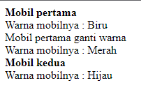
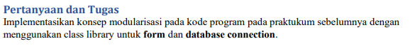

# Lab5Web
Nama : Iman Setiawan\
NIM : 312110219\
Kelas : TI.21.A1\
Matkul : Pemograman Mobile 2

## Dasar Class

Contoh membuat class mobil dan membuat fungsi2 sepert ( __construct() ) gantiWarna() dan TampilWarna(), Serta diimplementasikan membuat objek dan objek tersebut langsung di panggil.

## Tugas

Membuat program CRUD sederhana dengan konsep modularisasadi pada kode program dan menggunakan class library (Form.php) dan (Database.php) yang ada pada materi

