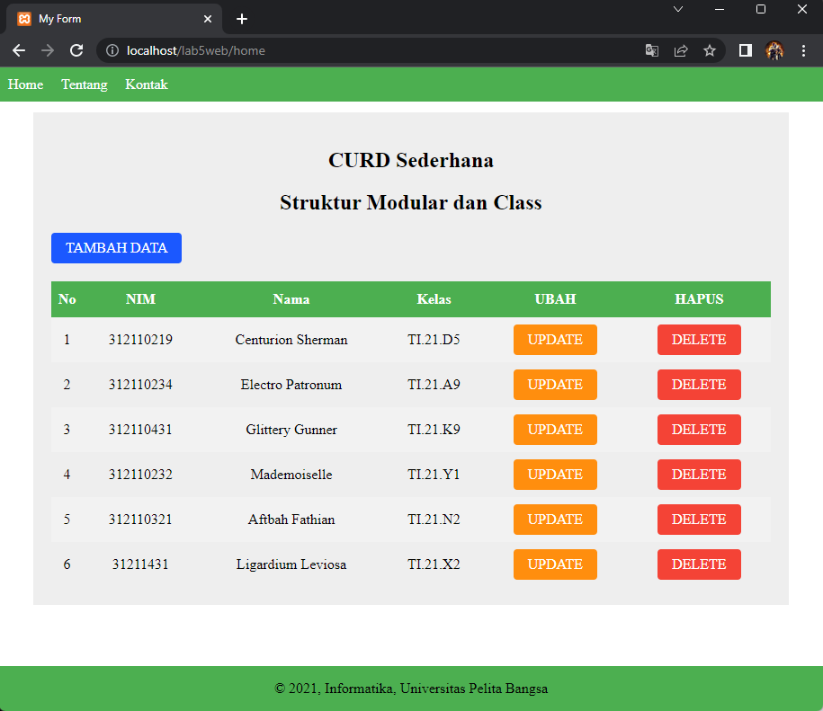

# Lab5Web
Nama : Iman Setiawan\
NIM : 312110219\
Kelas : TI.21.A1\
Matkul : Pemograman Mobile 2

## Dasar Class

Contoh membuat class mobil dan membuat fungsi2 sepert ( __construct() ) gantiWarna() dan TampilWarna(), Serta diimplementasikan membuat objek dan objek tersebut langsung di panggil.

## Tugas

Membuat program CRUD sederhana dengan konsep modularisasadi pada kode program dan menggunakan class library (Form.php) dan (Database.php) yang ada pada materi

Berikut adalah program yang sudah saya buat.

Menggunakan konsep 'Modularlisasi' dengan memecah bagian HTML menjadi 3 bagian yaitu header, home, dan footer. dan 'Routing' agar domain menjadi lebih singkat dari (/home.php) menjadi (/home) saja.

#### Tambah Data

Apabila di klik mengarah baris kode pada 'fungsi/tambah.php' dengan memanggil Class Database dan Form, menampilkan fungsi 'displayForm()' sebagai tampilan formulir untuk diisi dengan kolom kolom yang sesuai seperti yang ada pada database. Selanjut nya setelah form di isi, dan menekan tombol 'KIRIM' akan menjalankan baris kode pada clas 'Form' dengan fungsi 'addFields' mengumpulkan data pada array 'create' dan memasukannya ke database dengan fungsi 'insert()' yang ada pada class 'Database'

